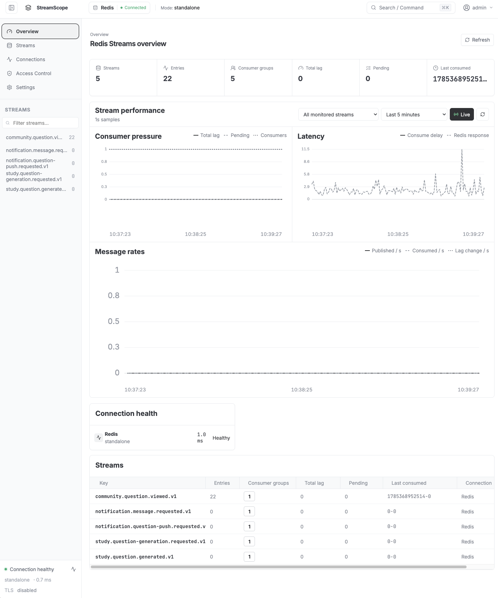
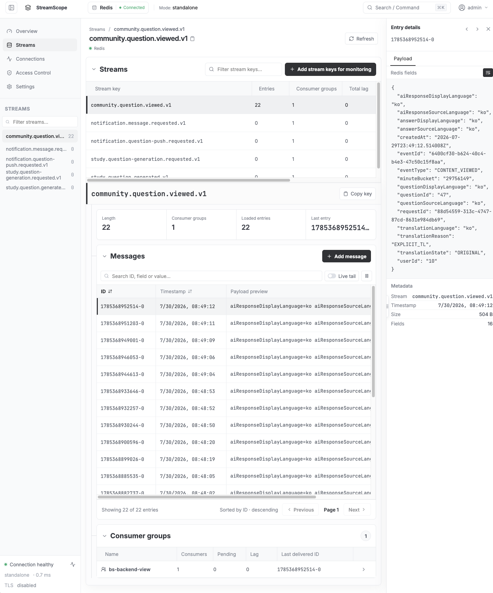
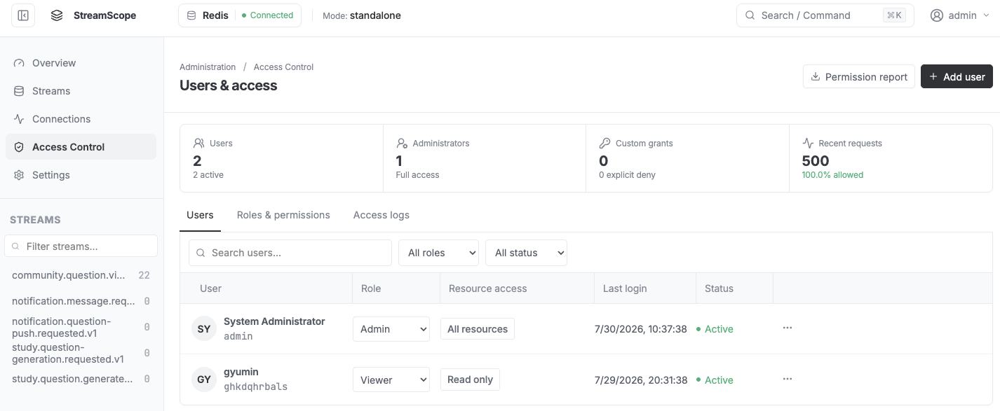

<p align="center">
  
</p>

<h1 align="center">RedisStreamScope</h1>

Redis Streams did not have the focused monitoring experience we wanted: a clear, Kafka-console-style view of streams, messages, consumer groups, lag, and delivery health. That is why we built RedisStreamScope.

RedisStreamScope is for developers and operators who want to inspect Redis Streams, follow consumer activity, diagnose lag, and manage access from one lightweight, self-hosted interface.

## Quick start

```sh
docker run -d \
  --name redisstreamscope \
  -p 8080:8080 \
  -v redisstreamscope-data:/data \
  ghcr.io/ghkdqhrbals/redisstreamscope:latest
```

Open [http://localhost:8080](http://localhost:8080) and sign in:

```text
Username: admin
Password: password
```

Open **Settings → Redis connections**, add your Redis server, test the connection, and save it.

## Features

- Browse Streams, messages, payloads, and consumer groups in one workspace.
- Monitor lag, pending entries, consumption delay, Redis latency, publish rate, consume rate, and lag change.
- Store one-second metrics for the recent window and seven-day minute rollups.
- Follow new entries with Live tail and cursor-based pagination.
- Add messages with optional `MAXLEN`.
- Manage standalone, Sentinel, and Cluster connections with ACL, passwords, TLS, or mTLS.
- Manage users, roles, detailed grants, and access logs.
- Switch between English and Korean.

## Screenshots

### Overview

<p align="center">
  
</p>

### Streams and messages

<p align="center">
  
</p>

### Roles and permissions

<p align="center">
  
</p>

## Technology

| Layer | Technology |
| --- | --- |
| Backend | Go 1.25, `go-redis` v9 |
| Frontend | React 19, TypeScript 5.9, Vite 7 |
| Storage | Embedded SQLite with WAL |
| Authentication | bcrypt passwords and server-side sessions |
| Container | Multi-stage Docker build, distroless runtime |
| CI | GitHub Actions with Redis version matrix and multi-architecture image publishing |

## Redis compatibility

| Redis Open Source | Support |
| --- | --- |
| `6.2` | Core Streams, groups, pending entries, `XCLAIM`, and `XAUTOCLAIM` |
| `7.0` | Consumer-group lag and `entries-read` metrics |
| `7.2`, `7.4` | Separate consumer inactive-time reporting |
| `8.0`, `8.2`, `8.4`, `8.6`, `8.8` | All current RedisStreamScope features and metrics |

Every pull request runs the integration suite against the latest patch release in each listed Redis version line.

## License

RedisStreamScope is available for noncommercial use under the [PolyForm Noncommercial License 1.0.0](./LICENSE). Commercial use is not permitted without a separate license from the copyright holder.
