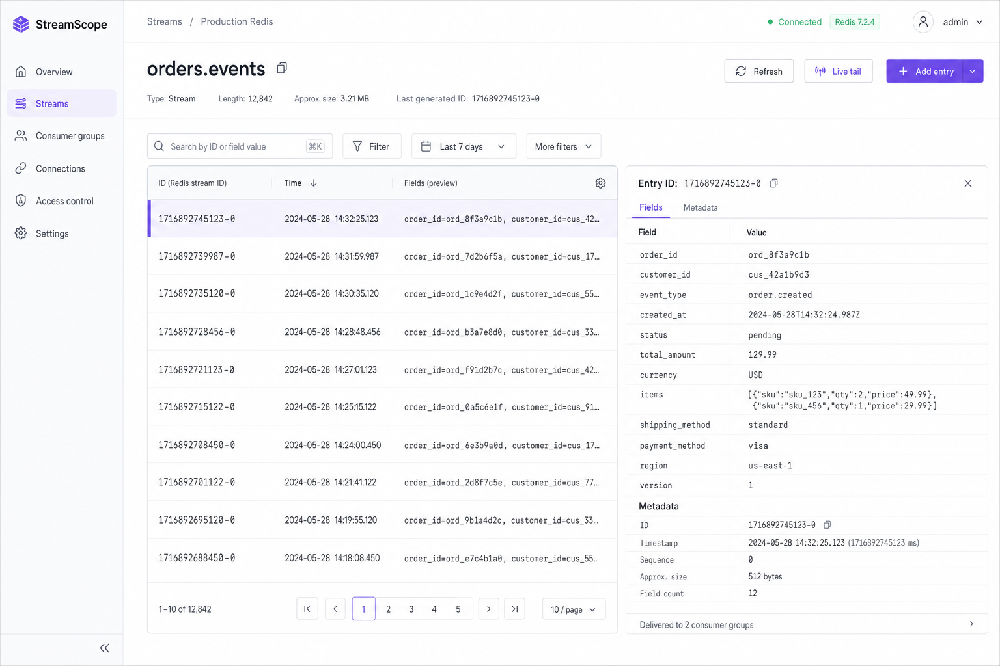
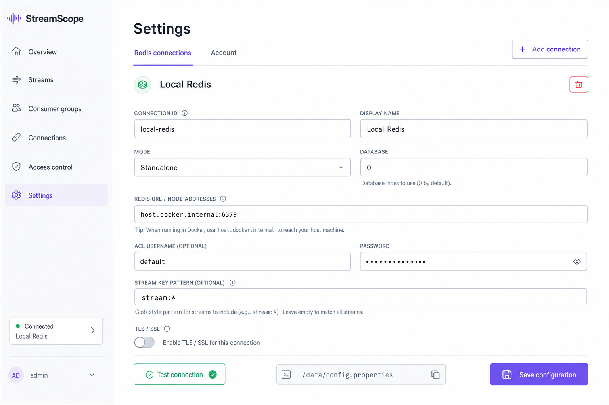

# StreamScope

A lightweight, self-hosted operations console for Redis Streams. Inspect streams and messages, follow live traffic, examine consumer groups and pending entries, manage Redis connections, and control user access from one interface.

[Documentation](https://ghkdqhrbals.github.io/streamscope/) · [Container image](https://github.com/ghkdqhrbals/streamscope/pkgs/container/streamscope)

## Preview

### Streams



### Redis Settings



## Quick start

```sh
docker compose up -d
```

Open [http://localhost:8080](http://localhost:8080) and sign in with:

- Username: `admin`
- Password: `password`

Add your Redis connection from **Settings**. When Redis runs directly on a macOS or Windows Docker host, use `host.docker.internal:6379` instead of `localhost:6379`.

## Docker run

```sh
docker run -d \
  --name streamscope \
  -p 8080:8080 \
  -v streamscope-data:/data \
  ghcr.io/ghkdqhrbals/streamscope:latest
```

To expose StreamScope on host port `9090`:

```sh
docker run -d \
  --name streamscope \
  -p 9090:8080 \
  -v streamscope-data:/data \
  ghcr.io/ghkdqhrbals/streamscope:latest
```

The first Redis connection can optionally be supplied at startup:

```sh
docker run -d \
  --name streamscope \
  -p 8080:8080 \
  -v streamscope-data:/data \
  -e REDIS_HOST=redis.example.internal \
  -e REDIS_PORT=6379 \
  -e REDIS_USERNAME=default \
  -e REDIS_PASSWORD=change-me \
  ghcr.io/ghkdqhrbals/streamscope:latest
```

Omit `REDIS_PASSWORD` when Redis does not require one. Startup settings are saved to `/data/config.properties` and remain available when the same volume is mounted again.

## Startup environment variables

| Variable | Default | Description |
| --- | --- | --- |
| `PORT` | `8080` | HTTP port inside the container |
| `REDIS_ID` | `default` | Connection ID |
| `REDIS_NAME` | `Redis` | Display name |
| `REDIS_MODE` | `standalone` | `standalone`, `sentinel`, or `cluster` |
| `REDIS_HOST` | — | Standalone Redis host |
| `REDIS_PORT` | `6379` | Redis port |
| `REDIS_NODES` | — | Cluster nodes (`host:port,host:port`) |
| `REDIS_URL` | — | `redis://` or `rediss://` URL |
| `REDIS_MASTER_NAME` | — | Sentinel master name |
| `REDIS_USERNAME` | — | Redis ACL username |
| `REDIS_PASSWORD` | — | Redis password |
| `REDIS_PASSWORD_FILE` | — | File containing the Redis password |
| `REDIS_DATABASE` | `0` | Redis database |
| `REDIS_KEY_PATTERN` | `*` | Stream discovery pattern |
| `REDIS_TLS` | `false` | Enable TLS |
| `REDIS_TLS_SERVER_NAME` | — | TLS server name |
| `REDIS_TLS_CA_FILE` | — | CA certificate path |
| `REDIS_TLS_CERT_FILE` | — | mTLS client certificate path |
| `REDIS_TLS_KEY_FILE` | — | mTLS private key path |

Use only one of `REDIS_HOST`, `REDIS_NODES`, or `REDIS_URL`. See the commented [config.properties](./config.properties) template for the complete persisted configuration format and defaults.

## Build locally

```sh
docker build -t streamscope:local .
```
