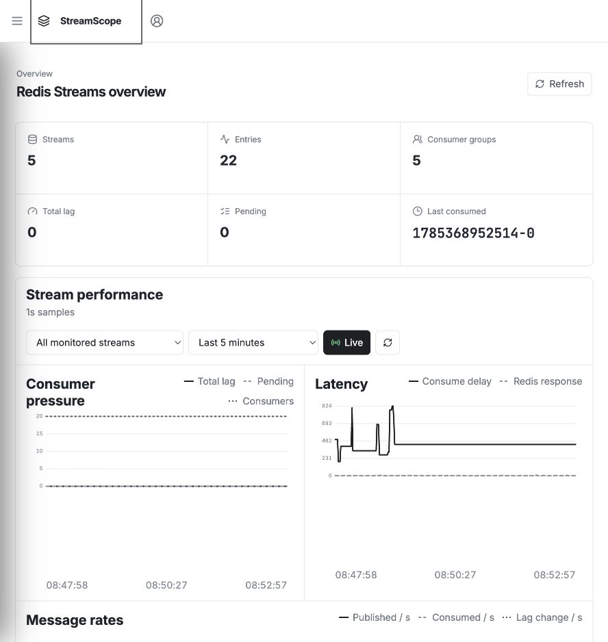
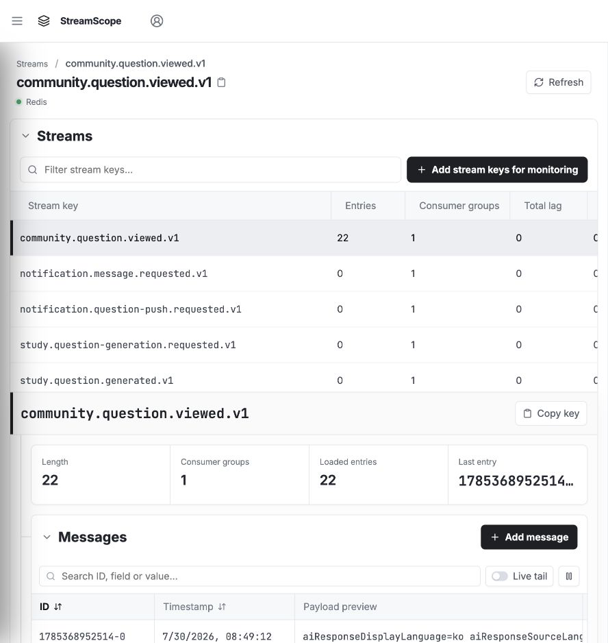
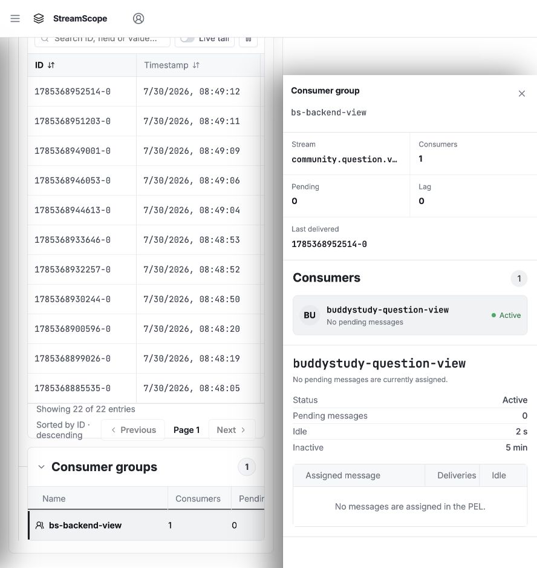
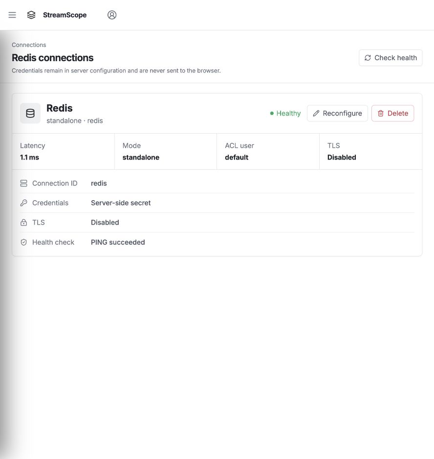
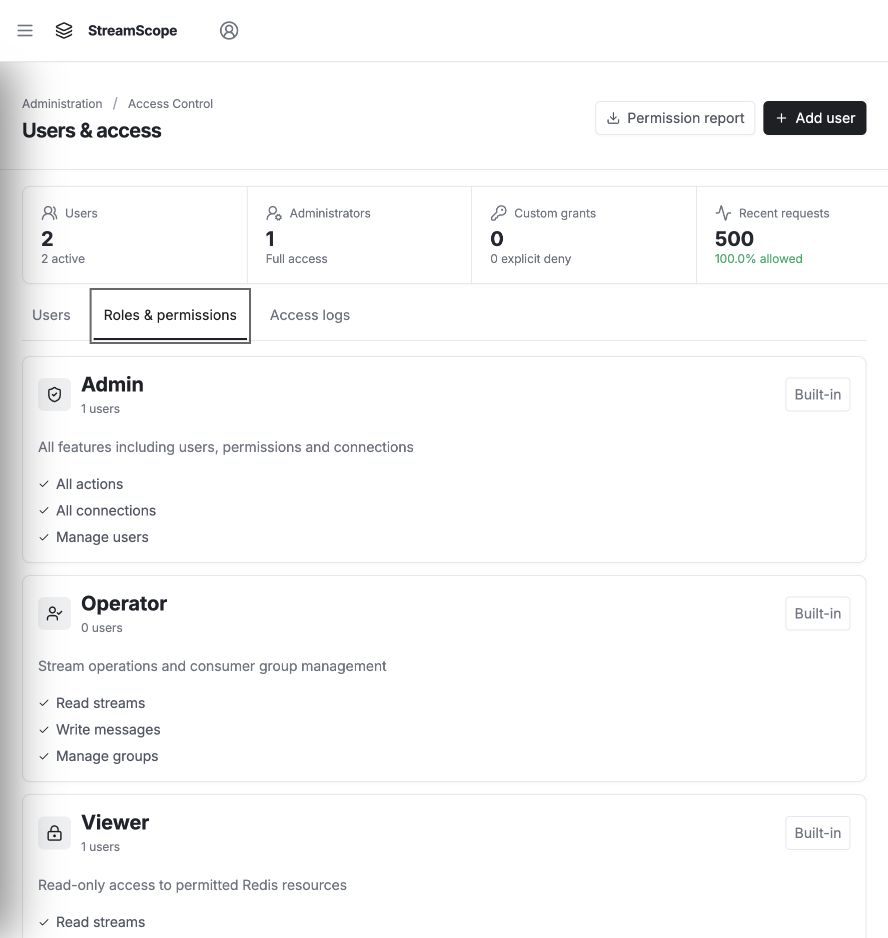

# StreamScope

A lightweight, self-hosted operations console for Redis Streams.

[](https://github.com/ghkdqhrbals/streamscope/releases/tag/v2.0.0)
[](https://github.com/ghkdqhrbals/streamscope/pkgs/container/streamscope)
[](#redis-compatibility)

[Documentation](https://ghkdqhrbals.github.io/streamscope/) · [Container image](https://github.com/ghkdqhrbals/streamscope/pkgs/container/streamscope)



## Quick start

```sh
docker run -d \
  --name streamscope \
  -p 8080:8080 \
  -v streamscope-data:/data \
  ghcr.io/ghkdqhrbals/streamscope:2.0.0
```

Open [http://localhost:8080](http://localhost:8080) and sign in:

```text
Username: admin
Password: password
```

Open **Settings → Redis connections**, add your Redis server, test the connection, and save it. If Redis runs on your macOS or Windows host, use `host.docker.internal:6379`.

## Features

- Browse Streams, messages, payloads, and consumer groups in one workspace.
- Monitor lag, pending entries, consumption delay, Redis latency, publish rate, consume rate, and lag change.
- Store one-second metrics for the recent window and seven-day minute rollups.
- Follow new entries with Live tail and cursor-based pagination.
- Add messages with optional `MAXLEN`.
- Manage standalone, Sentinel, and Cluster connections with ACL, passwords, TLS, or mTLS.
- Manage users, roles, detailed grants, and access logs.
- Switch between English and Korean.

## Screenshots

### Streams and messages



### Consumer groups



### Redis connections



### Roles and permissions



## Technology

| Layer | Technology |
| --- | --- |
| Backend | Go 1.25, `go-redis` v9 |
| Frontend | React 19, TypeScript 5.9, Vite 7 |
| Storage | Embedded SQLite with WAL |
| Authentication | bcrypt passwords and server-side sessions |
| Container | Multi-stage Docker build, distroless runtime |
| CI | GitHub Actions with Redis version matrix and multi-architecture image publishing |

## Redis compatibility

| Redis Open Source | Support |
| --- | --- |
| `6.2` | Core Streams, groups, pending entries, `XCLAIM`, and `XAUTOCLAIM` |
| `7.0` | Consumer-group lag and `entries-read` metrics |
| `7.2`, `7.4` | Separate consumer inactive-time reporting |
| `8.0`, `8.2`, `8.4`, `8.6`, `8.8` | All current StreamScope features and metrics |

Every pull request runs the integration suite against the latest patch release in each listed Redis version line.

## Release

Current release: **v2.0.0**

```text
ghcr.io/ghkdqhrbals/streamscope:2.0.0
ghcr.io/ghkdqhrbals/streamscope:2.0
ghcr.io/ghkdqhrbals/streamscope:2
ghcr.io/ghkdqhrbals/streamscope:latest
```
